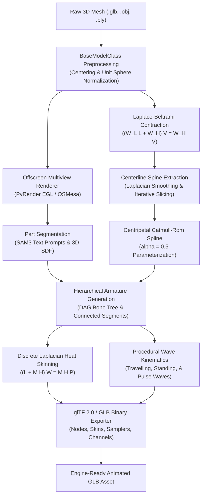

# Procedural Animation Generation Framework (`animgen`)

<div align="center">

[](https://www.python.org/downloads/)
[](https://www.gnu.org/licenses/agpl-3.0)
[](https://www.khronos.org/gltf/)
[](./tests/)
[](https://summerofcode.withgoogle.com/)
[](https://catrobat.org/)
[](./docs/reports/report-gsoc-2026.md)

**Zero-touch procedural rigging, discrete heat skinning, and biomechanical locomotion synthesis for non-humanoid 3D biological organisms.**

</div>

---

## Table of Contents

- [Overview](#overview)
- [Key Features](#key-features)
- [Architecture & Pipeline](#architecture)
- [Quickstart](#quickstart)
- [Command-Line Interface (CLI)](#cli-usage)
- [Biomechanical Locomotion Taxonomy & Implementation Status](#locomotion-taxonomy)
- [Visual Showcase & Milestones](#visual-showcase)
- [Interactive Demonstrators](#interactive-demonstrators)
- [Installation](#installation)
- [Testing & Quality Assurance](#testing-qa)
- [Comprehensive Final Report (`docs/reports/report-gsoc-2026.md`)](#final-report)
- [Acknowledgments](#acknowledgments)
- [Data Sources & References](#data-sources-references)
- [License](#license)

---

## Overview

Modern generative AI models (such as TripoSR, CRM, InstantMesh, LGM, and Trellis) can generate textured 3D meshes of aquatic and non-humanoid organisms in seconds. However, turning these static, non-canonical, often curved meshes into production-ready articulated assets has traditionally required hours of manual labor in digital content creation (DCC) tools like Blender or Maya.

**`animgen`** is a standalone procedural rigging, skinning, and animation framework built natively in Python over **glTF 2.0 / PyGLTFLib**. It transforms arbitrary static meshes into fully rigged, articulated, and procedurally animated models with continuous wave kinematics—**entirely in Python with zero runtime dependency on Blender**.

```
Static 3D Mesh (.glb / .obj / .ply) 
    ───► animgen ───► Rigged & Animated glTF 2.0 (.glb)
                          (Engine-ready for Unity, Unreal Engine, Three.js, WebGL)
```

---

## Key Features

- 🧬 **Zero-Shot Appendage Segmentation**: Open-vocabulary 2D/3D part segmentation via Meta SAM3 multi-view backprojection and 3D Shape Diameter Function (SDF) ray analysis.
- 🦴 **Curvature-Preserving Medial Skeleton Extraction**: Cotangent Laplace-Beltrami contraction with Laplacian smoothing and an iterative slicing algorithm to increase density and Taubin low-pass smoothing.
- 🔥 **Discrete Heat Diffusion Skinning**: Geometry-aware per-vertex bone weight solver based on the Baran & Popović heat conduction formulation $((L + MH)W = MHP)$ with sparse Cholesky factorization in $< 20\text{ ms}$ (verified parity against Blender's `meshlaplacian.cc`).
- 🌊 **Harmonic Wave Kinematics**: Procedural generators for Anguilliform (full-spine travelling wave), Carangiform (posterior oscillation), Rajiform (pectoral flapping), and escape pulse dynamics with SLERP keyframing.
- 📦 **Native glTF 2.0 / GLB Output**: Packs model-space inverse bind matrices (`MAT4`), normalized 4-joint skin weights (`JOINTS_0`, `WEIGHTS_0`), and keyframed Euler/quaternion tracks into engine-ready binary `.glb` containers.

---

<a id="architecture"></a>

## Architecture & Pipeline



---

## Quickstart

### 1. Fish Autorigging & Locomotion Export (5 Lines)

```python
from animgen import BaseModelClass, FishModels

# 1. Load static fish mesh (e.g. goldfish, shark, tuna, mackerel)
model = BaseModelClass("path/to/fish.glb")

# 2. Initialize and execute end-to-end autorigging & swimming animation
pipeline = FishModels(model)
animated_fish = pipeline.process()

# 3. Export engine-ready animated glTF 2.0 binary with swim, idle, sprint tracks
pipeline.export("animated_fish.glb")
```

### 2. Serpentine / Snake Autorigging & Wave Locomotion

```python
from animgen import BaseModelClass, SerpentineModels

# 1. Load static snake or eel mesh
model = BaseModelClass("path/to/snake.glb")

# 2. Run serpentine autorigging with 20-bone spine & continuous travelling waves
pipeline = SerpentineModels(model, num_bones=20)
pipeline.process()

# 3. Export with 'slow_slither' and 'fast_slither' locomotion animations
pipeline.export("animated_snake.glb")
```

### 3. Adding Custom Motion Clips via `generate_base_animation`

Synthesize custom swimming kinematics (e.g., gentle glides, fast darts, or escape bursts) using `FishModels.generate_base_animation` and append them directly to the model's animator:

```python
from animgen import BaseModelClass, FishModels, AnimationClip

# 1. Load and process standard model pipeline
model = BaseModelClass("path/to/fish.glb")
pipeline = FishModels(model)
pipeline.process()

# 2. Synthesize custom kinematic keyframes (e.g. high-speed escape burst)
burst_positions = FishModels.generate_base_animation(
    armature=pipeline.model.armature,
    wave_amplitude=0.35,
    wave_duration=0.6,
    tail_orientation=pipeline.tail_orientation,
    pectoral_mode="active",
    pectoral_flap_deg=20.0,
)

# 3. Wrap into an AnimationClip and register on the animator
clip = AnimationClip(
    name="escape_burst",
    duration=0.6,
    armature=pipeline.model.armature,
    is_loopable=True,
)
clip.positions = burst_positions
pipeline.model.animator.add_animation_clip(clip)

# 4. Export GLB containing the new 'escape_burst' clip alongside default tracks
pipeline.export("animated_fish_custom.glb")
```

---

<a id="cli-usage"></a>

## Command-Line Interface (CLI)

`animgen` includes a comprehensive CLI accessible via `animgen` or `python main.py`:

```bash
# Process end-to-end autorigging and procedural animation for fish
animgen process -m models/goldfish.glb -s fish -o outputs/goldfish_swimming.glb

# Process a serpentine creature (snake, eel) with custom bone density
animgen process -m models/sea_snake.glb -s serpentine --n-bones 24 -o outputs/snake_locomotion.glb

# Autorig only (armature + skin weights) without animation tracks
animgen autorig -m models/goldfish.glb -s fish -o outputs/goldfish_rigged.glb

# Inspect 3D model geometry, bounding box, skins, joints, and animation tracks
animgen info -m outputs/goldfish_swimming.glb
```

---

<a id="locomotion-taxonomy"></a>

## Biomechanical Locomotion Taxonomy & Implementation Status

`animgen` is architected around biological propulsion mechanics across aquatic and non-humanoid species:

| Locomotion Category | Representative Species | Propulsion Mechanism | Implementation Status | Pipeline Class |
|---|---|---|---|---|
| **Carangiform** | Fish, Sharks, Tuna, Mackerel | Posterior caudal fin oscillation & body wave | ✅ **COMPLETED** | `FishModels` |
| **Anguilliform** | Eels, Sea Snakes, Lampreys | Full-body continuous travelling wave | ✅ **COMPLETED** | `SerpentineModels` |
| **Rajiform** | Manta Rays, Stingrays, Skates | Lateral pectoral fin waves | ⏳ **TODO / Roadmap** | `MantaRayModels` (Planned) |
| **Labriform** | Sea Turtles, Penguins, Sea Lions | Pectoral power & recovery stroke cycles | ⏳ **TODO / Roadmap** | `FlipperModels` (Planned) |
| **Cephalopods** | Octopuses, Squids, Cuttlefish | Multi-chain tentacle wave + mantle pulse | ⏳ **TODO / Roadmap** | `CephalopodModels` (Planned) |
| **Gelatinous** | Jellyfish, Comb Jellies | Rhythmic radial bell contractions | ⏳ **TODO / Roadmap** | `JellyfishModels` (Planned) |
| **Arthropods** | Crabs, Lobsters, Mantis Shrimp | Segmented multi-leg walking & claw gaits | ⏳ **TODO / Roadmap** | `ArthropodModels` (Planned) |

> [!IMPORTANT]
> **Implementation Scope & TODOs:** Currently, **Fish (`FishModels`)** and **Serpentine / Snake (`SerpentineModels`)** are 100% completed, verified with integration tests, and production-ready. The remaining five biological locomotion types (Rajiform, Labriform, Cephalopods, Gelatinous, Arthropods) form the active project roadmap and are documented in detail in [GSoC 2026 Report](./docs/reports/report-gsoc-2026.md#4-locomotion-taxonomy-completed-implementations-vs-remaining-todos).

---

<a id="visual-showcase"></a>

## Visual Showcase & Milestones

### 1. Zero-Touch Procedural Rigging & Skeletal Armature
Extraction and conversion of discrete 3D meshes into centered skeletal chains, DAG bone hierarchies, and fin appendages across diverse species (Mackerel, Goldfish, and Sea Snake).

[](./assets/animgen/Rigged_demo.mp4)

*Inspect joint hierarchies, bone transformations, and skin weight assignments directly in standard glTF viewers.*

---

### 2. Biomechanical Swimming Locomotion Synthesis
Procedural wave kinematics generating multi-track continuous travelling body waves with Linear Blend Skinning (LBS) and Dual Quaternion Skinning (DQS) across production assets (Killer Whale, Shark, Tuna).

[](./assets/animgen/Animation_demo.mp4)

*Real-time multi-speed locomotion clips (`swim`, `idle`, `sprint`) with zero Blender runtime coupling.*

---

### 3. Real-Time Unity Visualizer & GPU Skinning Engine
End-to-end procedural asset loading, runtime GLTF decompression, and hardware GPU skinning within a Unity Universal Render Pipeline (URP) underwater environment.

[](./assets/animgen/FrontEndDemoCompleteStaticSite.mp4)

*Unity application featuring runtime species query spawner (`beluga whale`, `acadian redfish`), dynamic underwater lighting, and camera orbit controls.*

---

### 4. Synthetic Volume-Preserving Wave Skinning & Wave Superposition
Validation of complex harmonic wave generators driving synthetic volumetric cylindrical geometries with Dual Quaternion Skinning (DQS / DLB) to eliminate "candy-wrapper" joint collapsing:
- **Harmonic Wave Superposition:** Demonstrates the mathematical combination of multiple out-of-phase travelling waves and localized standing waves across the skeletal chain. By superimposing primary longitudinal body waves with high-frequency transverse oscillations, `animgen` produces organic propulsion and fluid trailing-edge dynamics.
- **Volume Preservation Under Combined Deformation:** While linear blend skinning (LBS) collapses cross-sectional mesh volume when perpendicular wave components interfere, Dual Quaternion Linear Blending (DLB) maintains exact geometric volume and cross-sectional integrity under extreme wave twist and bend angles.

[](./assets/animgen/Animation_Cylinder_Demo.mp4)

---

### 5. Morphological Appendage Segmentation
Zero-shot vision foundation model (Meta SAM3) and 3D Shape Diameter Function (SDF) segmentation to identify and partition anatomical appendages:
* **Dorsal Fin Segmentation:** [Demo Video](./assets/animgen/Mesh-Segmentation-Demo/Dorsal-Fin-Segmentation.mp4)
* **Caudal Fin / Tail Segmentation:** [Demo Video](./assets/animgen/Mesh-Segmentation-Demo/Tail-Segmentation.mp4)

---

## Interactive Demonstrators

### 🌐 Web Animation Editor (`demo/web_animation_generation/animation-editor`)
A browser-based 3D workspace engineered with **React 19, TypeScript, Three.js, React Three Fiber, and Zustand**:
- **Real-Time Kinematic Tuning:** Adjust wave amplitude, wavelength, growth rate, and frequency sliders with immediate 3D visual feedback.
- **Timeline Controller:** Scrub through individual animation frames, control playback speeds ($0.25\times$ to $2.0\times$), and switch between animation clips.
- **Transform & Hierarchy Inspector:** View skeletal DAG node trees, bone rotations, and mesh bounding box statistics.
- **Local Inspection:** Run locally via `cd demo/web_animation_generation/animation-editor && npm run dev`.

### 🎮 Unity Real-Time Visualizer (`demo/static_visualizer/UnityStaticVisualizer`)
A **Unity 6 / Universal Render Pipeline (URP)** project designed for high-performance deployment:
- **Hardware GPU Skinning:** Evaluates per-vertex skinning directly on the GPU for stable 60+ FPS performance.
- **Dynamic Species Spawner:** Query and spawn models on demand from a remote foundation model backend (`KaggleServer.ipynb`) via ngrok tunneling.
- **Atmospheric Underwater Scene:** Volumetric fog, caustic lighting, and orbit controls.

---

## Installation

### Prerequisites
- Python 3.11 or 3.12
- Linux (Ubuntu 22.04+ recommended) or macOS
- (Optional) NVIDIA GPU with CUDA 12.4+ for accelerated SAM3 vision segmentation

### Setup with `uv` (Recommended)

```bash
# Clone repository
git clone https://github.com/KahnSvaer/Procedural-Animation-Generation-Framework.git
cd Procedural-Animation-Generation-Framework

# Create virtual environment and install dependencies
uv venv .venv --python 3.11
source .venv/bin/activate
uv pip install -e ".[dev]"
```

### Setup with Standard `pip`

```bash
python3.11 -m venv .venv
source .venv/bin/activate
pip install -e ".[dev]"
```

### Environment Configuration & SAM3 Weights Download

To enable accelerated zero-shot vision segmentation via Meta SAM3 (`facebook/sam3`), copy [.env.example](./.env.example) to `.env` and provide your Hugging Face user access token:

```bash
# Copy template environment file
cp .env.example .env
```

Configure `.env` with your token:
```env
# Hugging Face Access Token (read access to facebook/sam3)
HF_TOKEN=hf_your_huggingface_access_token_here

# Optional: custom cache directory for downloaded checkpoints
HF_HOME=./models_cache/SAM_original/
```

### Hardware & Environment Health Check

Validate that Python, PyTorch, CUDA GPU acceleration, and core dependencies are correctly initialized:

```bash
python -c "
import sys, torch, pygltflib
print('Python  :', sys.version.split()[0])
print('PyTorch :', torch.__version__)
print('CUDA    :', torch.cuda.is_available())
if torch.cuda.is_available():
    print('GPU     :', torch.cuda.get_device_name(0))
print('glTF 2.0: Ready (pygltflib)')
"
```

> [!NOTE]
> SAM3 is fully optional. Specifying `use_sam=False` in `FishModels(model, use_sam=False)` or running without `--use-sam` executes purely geometric 3D Shape Diameter Function (SDF) segmentation in $< 1\text{ second}$ on any CPU without downloading neural weights.

---

<a id="testing-qa"></a>

## Testing & Quality Assurance

The framework includes a comprehensive test suite covering differential geometry operators, kinematics, heat skinning parity against Blender's `meshlaplacian.cc`, and end-to-end GLB export:

```bash
# Run fast test suite (60 tests in ~10 seconds)
pytest -m "not slow"

# Run end-to-end integration tests
pytest tests/test_integration.py -v

# Run full test suite including foundation model tests
pytest
```

---

<a id="final-report"></a>

## Comprehensive Final Report

A publication-grade technical report documenting mathematical derivations, ablation studies, empirical benchmarks, and system specifications is available in:
* 📄 **[Comprehensive GSoC 2026 Technical Report (`docs/reports/report-gsoc-2026.md`)](./docs/reports/report-gsoc-2026.md)**

---

<a id="acknowledgments"></a>

## Acknowledgments

Developed as part of **Google Summer of Code (GSoC) 2026** with **[Catrobat](https://catrobat.org/)**. Sincere thanks to mentors **Dhruvanshu Joshi**, **Tobias Schreck**, **Somya Barolia**, and **Benidikt Kantz** for their technical guidance, supervisors **Dr. Wolfgang Slany**, **Krishan Mohan Patel**, and **Himanshu Kumar** for their leadership and direction, and fellow contributors across the Catrobat community for their continuous support and collaboration.

---

<a id="data-sources-references"></a>

## Data Sources & References

### Data Sources
- **Biological Organism Imagery & Anatomy:** Sample species imagery and anatomical ground-truth profiles are sourced from the [NOAA Fisheries](https://www.fisheries.noaa.gov/) species directory.

### Scientific Literature & Mathematical References
- **Discrete Differential Geometry & Contraction:**
  - Pinkall, U., & Polthier, K. (1993). *Computing Discrete Minimal Surfaces and Their Conjugates*. Experimental Mathematics.
  - Au, O. K.-C., Tai, C.-L., Chu, H.-K., Cohen-Or, D., & Lee, T.-Y. (2008). *Skeleton Extraction by Mesh Contraction*. ACM Transactions on Graphics (SIGGRAPH).
- **Curvature Smoothing:**
  - Taubin, G. (1995). *Curve and Surface Smoothing Without Shrinkage*. IEEE International Conference on Computer Vision (ICCV).
- **Heat Diffusion Skinning:**
  - Baran, I., & Popović, J. (2007). *Automatic Rigging and Animation of 3D Characters*. ACM Transactions on Graphics (SIGGRAPH).
- **Dual Quaternion Kinematics:**
  - Kavan, L., Collins, S., Žára, J., & O'Sullivan, C. (2007). *Skinning with Dual Quaternions*. ACM SIGGRAPH Symposium on Interactive 3D Graphics and Games (I3D).

---

## License

This project is licensed under the [GNU Affero General Public License v3.0 (AGPL-3.0)](./LICENSE).


