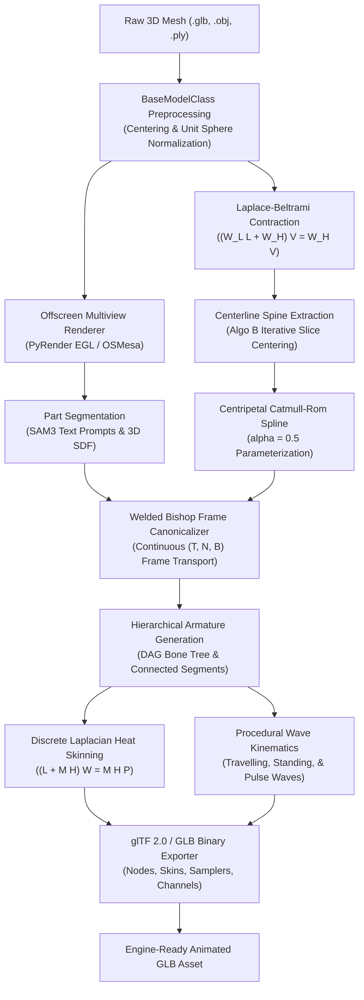

# Procedural Animation Generation Framework (`animgen`)

<div align="center">

[](https://www.python.org/downloads/)
[](https://opensource.org/licenses/MIT)
[](https://www.khronos.org/gltf/)
[](tests/)
[](https://summerofcode.withgoogle.com/)

**Zero-touch procedural rigging, canonical mesh unrolling, and biomechanical locomotion synthesis for non-humanoid 3D biological organisms.**

[Overview](#overview) •
[Key Features](#key-features) •
[Architecture](#architecture--pipeline) •
[Quickstart](#quickstart) •
[CLI Usage](#command-line-interface-cli) •
[Locomotion Taxonomy](#biomechanical-locomotion-taxonomy) •
[Milestones & Demos](#milestones--visual-showcase) •
[Installation](#installation)

</div>

---

## Overview

Modern generative AI models (such as TripoSR, CRM, InstantMesh, LGM, and Trellis) can generate intricate 3D meshes of aquatic and non-humanoid organisms in seconds. However, turning these static, non-canonical, often curved meshes into production-ready articulated assets has traditionally required hours of manual work in digital content creation (DCC) software like Blender or Maya.

**`animgen`** is a standalone, high-level procedural rigging and animation framework built directly over **glTF 2.0 / PyGLTFLib**. It transforms arbitrary static meshes into fully rigged, articulated, and animated models with continuous wave kinematics—**entirely in Python with zero runtime dependency on Blender**.

```
Static 3D Mesh (.glb / .obj) 
    ───► animgen ───► Rigged & Animated glTF 2.0 (.glb)
                          (Ready for Unity, Unreal Engine, Three.js, WebGL)
```

---

## Key Features

- 🧬 **Zero-Shot Appendage Segmentation**: Open-vocabulary 2D/3D part segmentation via Meta SAM3 multi-view backprojection and 3D Shape Diameter Function (SDF) analysis.
- 🦴 **Curvature-Preserving Medial Skeleton Extraction**: Cotangent Laplace-Beltrami contraction with iterative orthogonal cross-sectional slice centroid refinement (Algo B) and Taubin low-pass smoothing.
- 📐 **Volume-Preserving Welded Bishop Transport**: Unrolls curved input poses into straight canonical configurations using singularity-free parallel transport frames $(T, N, B)$, spatial UV seam welding (zero texture tearing), and monotonic longitudinal cross-section projection.
- 🔥 **Discrete Heat Diffusion Skinning**: Geometry-aware per-vertex bone weight solver based on the Baran & Popović heat conduction formulation $((L + MH)W = MHP)$ with sparse Cholesky factorization in $< 20\text{ ms}$.
- 🌊 **Harmonic Wave Kinematics**: Procedural generators for Anguilliform (full-spine travelling wave), Carangiform (posterior oscillation), Rajiform (pectoral flapping), and escape pulse dynamics.
- 📦 **Native glTF 2.0 / GLB Output**: Packs model-space inverse bind matrices (`MAT4`), normalized 4-joint skin weights (`JOINTS_0`, `WEIGHTS_0`), and keyframed Euler/quaternion tracks into engine-ready binary `.glb` containers.

---

## Architecture & Pipeline



---

## Quickstart

### 1. Fish Autorigging & Locomotion Export (5 Lines)

```python
from animgen import BaseModelClass, FishModels

# 1. Load static fish mesh (e.g. goldfish, shark, tuna)
model = BaseModelClass("path/to/fish.glb")

# 2. Initialize and execute end-to-end autorigging & swimming animation
pipeline = FishModels(model, prompts=["dorsal fin", "caudal fin"])
animated_fish = pipeline.process()

# 3. Export engine-ready animated glTF 2.0 binary
pipeline.export("animated_fish.glb")
```

### 2. Serpentine / Snake Autorigging & Wave Locomotion

```python
from animgen import BaseModelClass, SerpentineModels

# 1. Load static snake or eel mesh
model = BaseModelClass("path/to/snake.glb")

# 2. Run serpentine autorigging with 20-bone spine & travelling waves
pipeline = SerpentineModels(model, num_bones=20)
pipeline.process()

# 3. Export with 'slow' and 'fast' locomotion animations
pipeline.export("animated_snake.glb")
```

### 3. Canonical Mesh Straightening via Welded Bishop Frames

```python
from animgen import load_model, straighten

# Load curved mesh and straighten along primary longitudinal axis
mesh = load_model("path/to/curved_model.glb")
straight_mesh = straighten(mesh, axis="y")

straight_mesh.export("straightened_model.glb")
```

---

## Command-Line Interface (CLI)

`animgen` includes a full-featured CLI accessible via the `animgen` command or `python main.py`:

```bash
# Process end-to-end autorigging and procedural animation
animgen process -m models/goldfish.glb -s fish -o outputs/goldfish_swimming.glb

# Process a serpentine creature (snake, eel) with custom bone density
animgen process -m models/sea_snake.glb -s serpentine --n-bones 24 -o outputs/snake_locomotion.glb

# Autorig only (armature + skin weights) without animation tracks
animgen autorig -m models/goldfish.glb -s fish -o outputs/goldfish_rigged.glb

# Straighten a curved mesh using volume-preserving welded Bishop transport
animgen straighten -m models/curved_fish.glb --axis y -o outputs/fish_canonical.glb

# Inspect 3D model geometry, bounding box, skins, joints, and animation tracks
animgen info -m outputs/goldfish_swimming.glb
```

---

## Biomechanical Locomotion Taxonomy

`animgen` synthesizes movement patterns derived from real biological propulsion mechanics:

| Category | Representative Species | Propulsion Mechanism | Wave Generator Configuration |
|---|---|---|---|
| **Carangiform** | Fish, Sharks, Tuna | Posterior caudal fin oscillation | Travelling wave ($g > 0$, concentrated on posterior $50\%$ of spine) |
| **Anguilliform** | Eels, Sea Snakes, Lampreys | Full-body continuous undulation | Full-spine travelling wave ($100\%$ length, $N \ge 2.0$) |
| **Rajiform** | Manta Rays, Stingrays | Lateral pectoral fin waves | Symmetrical dual standing waves along lateral wing bones |
| **Labriform** | Sea Turtles, Penguins | Pectoral power strokes | Cyclic Forward Kinematics power and recovery state machine |
| **Cephalopods** | Octopuses, Squids | Tentacle undulation & jetting | Coordinated multi-chain tentacle waves + mantle pulse wave |
| **Gelatinous** | Jellyfish, Comb Jellies | Rhythmic bell contractions | Radial pulse wave displacement with passive drag relaxation |

---

## Milestones & Visual Showcase

### Milestone 0: 3D Foundational Model Import to Unity
Real-time GPU skinning and procedural asset loading within a Unity WebGL / Desktop application.
* [Demo Video](assets/demo_videos/FrontEndDemoCompleteStaticSite.mp4)

---

### Milestone 1: Point to Spline to Skeletal Armature
Extraction and conversion of discrete spatial point clusters into continuous centripetal Catmull-Rom splines ($\alpha=0.5$) and hierarchical skeletal armatures.
* [Demo Video](assets/demo_videos/PointToSplineToArmatureDemo.mp4)

---

### Milestone 2: Morphological Part Segmentation
Zero-shot vision foundation model (SAM3) and Shape Diameter Function (SDF) segmentation to identify and partition anatomical appendages.
* **Dorsal Fin Segmentation:** [Demo Video](assets/demo_videos/Mesh-Segmentation-Demo/Dorsal-Fin-Segmentation.mp4)
* **Caudal Fin / Tail Segmentation:** [Demo Video](assets/demo_videos/Mesh-Segmentation-Demo/Tail-Segmentation.mp4)

---

### Milestone 3: Procedural Wave Animation & Mesh Skinning
Continuous travelling and standing wave generators driving skeletal chains with real-time Dual Quaternion Skinning (DQS / DLB) and Linear Blend Skinning (LBS) without Blender coupling.

[](assets/demo_videos/Animation_Cylinder_Demo.mp4)

---

## Technical Innovation: Welded Bishop Transport

When large foundation models generate 3D meshes, UV seams frequently create coincident vertices that share the exact same 3D coordinates but have distinct UV coordinates or split normal vectors. Standard segment-based skeletal deformation causes these coincident vertices to evaluate disparate transformation matrices, resulting in **torn mesh seams and slicing artifacts**.

`animgen` solves this through a three-stage geometric transport pipeline:
1. **Spatial Vertex Welding**: Automatically identifies co-located vertex clusters ($10^{-5}$ tolerance) via spatial hashing, deforms unique 3D positions, and broadcasts coordinates back to original buffer indices—**preserving all original UVs and texture materials with 0.0 seam separation**.
2. **Continuous Node Frame Interpolation**: Calculates orthonormal Bishop frames $(T_i, N_i, B_i)$ at spine nodes and linearly interpolates continuous moving frames along segment intervals, eliminating discrete rotational step jumps.
3. **Monotonic Axis Projection**: For spines aligned with a primary longitudinal axis, vertices project along monotonic orthogonal cross-sections, eliminating focal crossing and caustics where tall dorsal fins previously jumped across disparate spine segments.

---

## Installation

### Prerequisites
- Python 3.11 or 3.12
- Linux (Ubuntu 22.04+ recommended) or macOS
- (Optional) NVIDIA GPU with CUDA 12.4+ for accelerated SAM3 vision segmentation

### Setup with `uv` (Recommended)

```bash
# Clone the repository
git clone https://github.com/KahnSvaer/Procedural-Animation-Generation-Framework.git
cd Procedural-Animation-Generation-Framework

# Create virtual environment and install dependencies
uv venv .venv --python 3.11
source .venv/bin/activate
uv pip install -e ".[dev]"
```

### Setup with Standard `pip`

```bash
python3.11 -m venv .venv
source .venv/bin/activate
pip install -e ".[dev]"
```

---

## Testing & Quality Assurance

The framework includes a comprehensive test suite covering differential geometry operators, kinematics, heat skinning parity against Blender's `meshlaplacian.cc`, and end-to-end GLB export:

```bash
# Run fast test suite (60 tests in ~8 seconds)
pytest -m "not slow"

# Run integration tests specifically
pytest tests/test_integration.py -v

# Run full test suite including slow foundation model tests
pytest
```

---

## Interactive Demonstrators

- **Web Animation Editor (`demo/web_animation_generation/animation-editor`)**: Browser-based interactive UI for tuning wave amplitude, frequency, and growth factor in real time.
- **Unity Visualizer (`demo/static_visualizer/UnityStaticVisualizer`)**: Unity project showcasing real-time GPU skinning of exported `.glb` files with orbit camera controls.
- **VS Code 3D Mesh Viewer**: Recommended for local model inspection using the [VS Code 3D Mesh Viewer extension](https://marketplace.visualstudio.com/items?itemName=AssetToolLabs.mesh-viewer-vscode).

---

## Data Sources & Acknowledgments

- Developed as part of **Google Summer of Code (GSoC) 2026**.
- Anatomical references and sample images sourced from the [NOAA Fisheries](https://www.fisheries.noaa.gov/) species directory.
- Mathematical formulations ground in Pinkall & Polthier (1993), Taubin (1995), Baran & Popović (2007), and Kavan et al. (2007).

---

## License

This project is licensed under the [MIT License](LICENSE).
