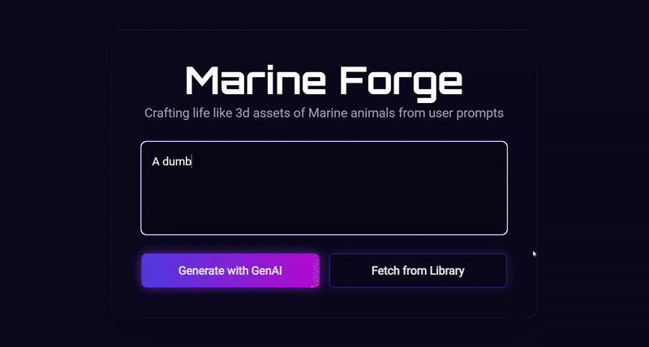
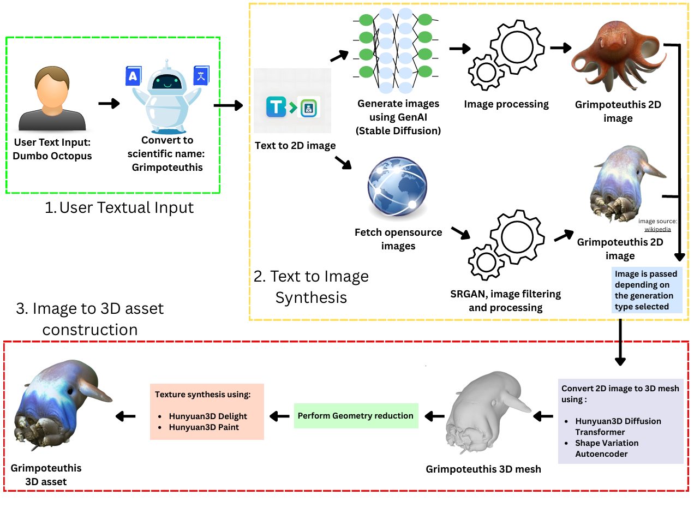
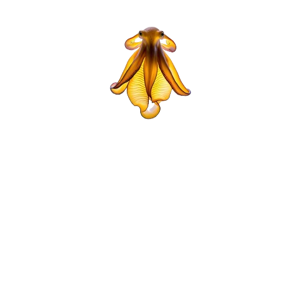
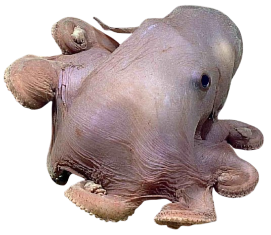

<div align="center">

# mArIne3D

[](https://www.python.org/downloads/)
[](./LICENSE)
[](https://www.khronos.org/gltf/)
[](./tests/)
[-orange.svg)](./docs/reports/report-gsoc-2025.md)
[-darkorange.svg)](./docs/reports/report-gsoc-2026.md)
[](https://catrobat.org/)
[](./docs/reports/report-gsoc-2025.md)
[](./docs/reports/report-gsoc-2026.md)

**An end-to-end generative 3D reconstruction and zero-touch procedural animation framework for non-humanoid marine organisms: from natural language prompts and marine imagery to production-ready, rigged, skinned, and animated glTF 2.0 assets.**

**Mentoring Organization:** [Catrobat](https://catrobat.org/)  
**Programs:** [Google Summer of Code 2025](./docs/reports/report-gsoc-2025.md) & [Google Summer of Code 2026](./docs/reports/report-gsoc-2026.md)

</div>

---

## Table of Contents

1. [Overview & Unified Vision](#1-overview--unified-vision)
2. [Visual Showcase & Milestone Gallery](#2-visual-showcase--milestone-gallery)
   - [2.1 Generative 2D-to-3D Marine Reconstruction](#21-generative-2d-to-3d-marine-reconstruction)
     - [2.1.1 End-to-End Text-to-3D Asset Synthesis](#211-end-to-end-text-to-3d-asset-synthesis)
     - [2.1.2 Dual-Mode Architectural Generation Flow](#212-dual-mode-architectural-generation-flow)
     - [2.1.3 Generative Species Synthesis: Dumbo Octopus](#213-generative-species-synthesis-dumbo-octopus-grimpoteuthis)
     - [2.1.4 Real-World Oceanographic Database Retrieval & SR_GAN Enhancement](#214-real-world-oceanographic-database-retrieval--sr_gan-enhancement-fathomnet)
   - [2.2 Procedural Skeletal Extraction & Rigging](#22-procedural-skeletal-extraction--rigging)
   - [2.3 Biomechanical Swimming Locomotion Synthesis](#23-biomechanical-swimming-locomotion-synthesis)
   - [2.4 Unity 6 Real-Time Visualizer & Hardware GPU Skinning](#24-unity-6-real-time-visualizer--hardware-gpu-skinning)
   - [2.5 Multi-Wave Interference & Dual Quaternion Skinning on Cylinders](#25-multi-wave-interference--dual-quaternion-skinning-on-cylinders)
3. [Core Technical Pillars](#3-core-technical-pillars)
   - [3.1 Dual-Mode 2D Concept Engine](#31-dual-mode-2d-concept-engine)
   - [3.2 Neural 3D Asset Reconstruction & Optimization](#32-neural-3d-asset-reconstruction--optimization)
   - [3.3 Zero-Touch Procedural Rigging & Canonicalization](#33-zero-touch-procedural-rigging--canonicalization)
   - [3.4 Harmonic Wave Kinematics & Locomotion Generators](#34-harmonic-wave-kinematics--locomotion-generators)
   - [3.5 Native glTF 2.0 / GLB Binary Output Pipeline](#35-native-gltf-20--glb-binary-output-pipeline)
4. [Biomechanical Locomotion Taxonomy & Implementation Status](#4-biomechanical-locomotion-taxonomy--implementation-status)
5. [Interactive Demonstrators & Client Platforms](#5-interactive-demonstrators--client-platforms)
   - [5.1 React + Three.js Web Animation Editor](#51-react--threejs-web-animation-editor)
   - [5.2 Unity 6 Real-Time Visualizer & GPU Skinning Engine](#52-unity-6-real-time-visualizer--gpu-skinning-engine)
6. [Installation & Getting Started](#6-installation--getting-started)
   - [6.1 Prerequisites](#61-prerequisites)
   - [6.2 Environment Setup (`uv` or `pip`)](#62-environment-setup-uv-or-pip)
   - [6.3 Environment Configuration & Health Check](#63-environment-configuration--health-check)
   - [6.4 Compiling the Custom C++/CUDA Rasterizer](#64-compiling-the-custom-ccuda-rasterizer)
   - [6.5 Pretrained Model Acquisition](#65-pretrained-model-acquisition)
7. [CLI & Python API Quickstart](#7-cli--python-api-quickstart)
   - [7.1 Command-Line Interface (CLI)](#71-command-line-interface-cli)
   - [7.2 Python API Usage](#72-python-api-usage)
   - [7.3 Generative Text-to-3D Pipeline Execution](#73-generative-text-to-3d-pipeline-execution)
8. [Repository File Structure](#8-repository-file-structure)
9. [Testing, Quality Assurance & Reproducibility](#9-testing-quality-assurance--reproducibility)
10. [GSoC Final Reports & Milestone Documentation](#10-gsoc-final-reports--milestone-documentation)
11. [Acknowledgments & Mentorship](#11-acknowledgments--mentorship)
12. [Data Sources & Academic References](#12-data-sources--academic-references)
13. [License](#13-license)

---

## 1. Overview & Unified Vision

Marine biology and underwater simulation face a persistent challenge: **the scarcity of high-fidelity, articulated 3D models of aquatic life**. Traditional 3D creation and digital content creation (DCC) pipelines in software like Blender or Maya require hours of expert manual sculpting, retopology, UV unwrapping, skeletal rigging, and keyframe animation for every single creature.

Across two consecutive Google Summer of Code programs with **Catrobat**, this repository develops a complete, automated end-to-end pipeline:

1. **GSoC 2025 (`mArIne3D`): Generative 3D Asset Creation**  
   Converts natural language prompts into realistic 2D images via **Stable Diffusion 3.5 Large Turbo** (with 4-bit NF4 quantization) or queries the **FathomNet** oceanographic database for underrepresented species with automated quality scoring and **SR_GAN** super-resolution. The resulting imagery is reconstructed into 3D meshes using **Tencent Hunyuan3D-2**, optimized via a 90% triangle decimation strategy, and prepared for downstream animation.
2. **GSoC 2026 (`animgen`): Procedural Rigging & Biomechanical Locomotion Framework**  
   Bridges the **Generative 3D Gap**. Modern 3D foundation models output static, unrigged meshes in curved, dynamic rest poses with coincident duplicate vertices along split UV seams. Built natively in Python with **zero runtime dependency on Blender**, `animgen` provides zero-touch appendage segmentation (Meta SAM3 + 3D Shape Diameter Function), cotangent Laplace-Beltrami contraction, Laplacian smoothing and iterative slicing/splicing to increase density, volume-preserving Welded Bishop Transport canonical unrolling, discrete heat diffusion skinning (evaluated in $< 20\text{ ms}$ with verified parity to Blender's `meshlaplacian.cc`), and procedural wave kinematics (carangiform, anguilliform, standing, and pulse waves) exported directly as standard **glTF 2.0 / GLB** binaries.

---

## 2. Visual Showcase & Milestone Gallery

### 2.1 Generative 2D-to-3D Marine Reconstruction
Demonstrating the dual-mode concept generation and Tencent Hunyuan3D-2 neural mesh reconstruction pipeline from natural language prompts and marine database imagery.

#### 2.1.1 End-to-End Text-to-3D Asset Synthesis
Demonstrates the complete transformation pipeline starting from a natural language text prompt to synthesize an anatomically accurate 2D render, followed by Tencent Hunyuan3D-2 neural mesh generation, intelligent triangle decimation, and multi-view neural paint texturing exported directly into production `.glb` format.

<div align="center">
  <a href="./assets/text2_3D/first.mp4">
    
  </a>
  <p><em>Figure 1a: Full end-to-end text-to-2D to 3D reconstruction pipeline (<a href="./assets/text2_3D/first.mp4">view full video</a>).</em></p>
</div>

---

#### 2.1.2 Dual-Mode Architectural Generation Flow
Direct text-to-3D generation suffers from extreme scarcity of open 3D marine datasets. Our modular architecture addresses this bottleneck through a decoupled two-step framework: translating text prompts into clean 2D imagery (via Stable Diffusion 3.5 Large Turbo or FathomNet oceanographic image fetching), followed by Tencent Hunyuan3D-2 3D mesh generation with a 90% triangle decimation optimization prior to neural UV painting.

<div align="center">
  
  <p><em>Figure 1b: Dual-mode 2D concept generation and Tencent Hunyuan3D-2 neural 3D reconstruction architecture.</em></p>
</div>

---

#### 2.1.3 Generative Species Synthesis: Dumbo Octopus (*Grimpoteuthis*)
Demonstrates high-fidelity generative 3D modeling of complex marine organisms. By combining automated biological prompt tuning (adding anatomical correctness, studio lighting, and neutral backdrop tokens) with 4-bit NF4 quantized Stable Diffusion 3.5 Large Turbo, the pipeline eliminates visual artifacts and generates clean, isolated assets ready for downstream 3D reconstruction.

<div align="center">
  
  <p><em>Figure 1c: High-fidelity textured 3D asset of a Dumbo Octopus synthesized through GenAI prompt tuning and Hunyuan3D-2.</em></p>
</div>

---

<a id="214-real-world-oceanographic-database-retrieval--sr_gan-enhancement-fathomnet"></a>
#### 2.1.4 Real-World Oceanographic Database Retrieval & SR_GAN Enhancement (FathomNet)
For rare, deep-sea, and underrepresented marine species where text-to-image foundation models lack training coverage, the system queries the open-source FathomNet biological database using scientific taxonomic names. Retrieved candidates undergo automated multi-factor scoring (brightness, Laplacian variance sharpness, contrast) and automatic centering crops, followed by SR_GAN super-resolution upscaling to provide clean, high-resolution inputs for 3D reconstruction.

<div align="center">
  
  <p><em>Figure 1d: Real-world marine creature retrieval from FathomNet enhanced with automated quality scoring and SR_GAN super-resolution.</em></p>
</div>

---

### 2.2 Procedural Skeletal Extraction & Rigging
Zero-touch extraction of 1D medial curves, Laplacian smoothing and iterative slicing/splicing to increase density, and hierarchical armature synthesis across diverse aquatic morphologies (Mackerel, Goldfish, and Sea Snake).

<div align="center">
  <a href="./assets/animgen/Rigged_demo.mp4">
    
  </a>
  <p><em>Figure 2: Automated skeletal armature and joint hierarchies extracted by <code>animgen</code> and inspected in the 3D viewer (<a href="./assets/animgen/Rigged_demo.mp4">view full video</a>).</em></p>
</div>

---

### 2.3 Biomechanical Swimming Locomotion Synthesis
Procedural wave kinematics generating continuous travelling body undulations with Dual Quaternion and Linear Blend skinning across production models (Killer Whale, Shark, Tuna).

<div align="center">
  <a href="./assets/animgen/Animation_demo.mp4">
    
  </a>
  <p><em>Figure 3: Procedural swimming locomotion with keyframed animation tracks and multi-speed timelines (<a href="./assets/animgen/Animation_demo.mp4">view full video</a>).</em></p>
</div>

---

### 2.4 Unity 6 Real-Time Visualizer & Hardware GPU Skinning
Hardware GPU skinning (`gpuSkinning: 1`) of exported `.glb` models running at stable 60+ FPS with remote GPU streaming, runtime species search/spawn, and underwater caustics.

<div align="center">
  <a href="./assets/animgen/FrontEndDemoCompleteStaticSite.mp4">
    
  </a>
  <p><em>Figure 4: Unity Real-Time Visualizer spawning and swimming an articulated 3D marine asset with dynamic underwater lighting (<a href="./assets/animgen/FrontEndDemoCompleteStaticSite.mp4">view full video</a>).</em></p>
</div>

---

### 2.5 Multi-Wave Interference & Dual Quaternion Skinning on Cylinders
Validation of complex harmonic wave superposition and Dual Quaternion Linear Blending (DLB) on synthetic cylindrical geometry, demonstrating zero volume loss at acute bending angles.

<div align="center">
  <a href="./assets/animgen/Animation_Cylinder_Demo.mp4">
    
  </a>
  <p><em>Figure 5: Synthetic wave skinning demonstration comparing multi-wave superposition and deformation continuity along skeletal chains (<a href="./assets/animgen/Animation_Cylinder_Demo.mp4">view full video</a>).</em></p>
</div>

---

## 3. Core Technical Pillars

### 3.1 Dual-Mode 2D Concept Engine
Direct text-to-3D generation suffers from dataset scarcity for marine life. We bypass this bottleneck using a modular two-step paradigm:

1. **Generative AI Pathway:**
   - **Stable Diffusion 3.5 Large Turbo:** Synthesizes high-fidelity 2D concept images from textual prompts.
   - **4-Bit NF4 Quantization:** Enables execution on consumer GPUs (e.g. RTX 3050 with 6GB VRAM, RTX 3090).
   - **Biological Prompt Tuning:** Augments species queries with anatomical correctness, studio lighting, and neutral backgrounds to eliminate limb mutations and visual artifacts.
2. **Real-World Image Pathway (FathomNet):**
   - Fallback system querying the open-source **FathomNet** oceanographic database using scientific taxonomic names.
   - **Multi-Factor Quality Scoring:** Ranks candidate images using an automated composite metric evaluating brightness, sharpness (Laplacian variance), and contrast.
   - **Super-Resolution:** Passes the highest-scoring candidate through an **SR_GAN** super-resolution network with automatic centering crops before 3D reconstruction.

---

### 3.2 Neural 3D Asset Reconstruction & Optimization
- **Tencent Hunyuan3D-2 Pipeline:** Deploys `Hunyuan3DDiTFlowMatchingPipeline` for structural geometry synthesis and `Hunyuan3DPaintPipeline` for neural delighting and UV texturing.
- **Mesh Simplification Optimization:** Raw Hunyuan3D meshes contain 10,000–15,000 triangles. Texturing unsimplified high-density meshes causes severe GPU memory spikes and slow processing. We apply a geometry-preserving edge collapse decimation step reducing triangle counts by **up to 90%** prior to the paint pipeline, accelerating inference without compromising visual fidelity.
- **Local Low-VRAM Inference:** Employs class-level submodule loading, immediate checkpoint weight purging, process isolation, FP16 execution, and CPU offloading to run the complete pipeline on hardware with as low as **6GB VRAM**.

---

### 3.3 Zero-Touch Procedural Rigging & Canonicalization

#### Medial Skeleton Extraction & Refinement
- **Cotangent Laplace-Beltrami Contraction (`mesh_contraction.py`):** Solves an iterative geometry contraction linear system based on Au et al. using a cotangent Laplacian operator and volume-anchoring constraints to collapse the mesh inward into a clean 1D skeletal curve while retaining overall topology.
- **Laplacian Smoothing & Iterative Slicing/Splicing (`refine_skelaton.py`):** Standard contraction leaves nodes skewed toward high-curvature surfaces. This stage applies Laplacian smoothing and an iterative slicing algorithm to increase density along the centerline, intersecting perpendicular cutting planes with the original uncontracted mesh to extract 2D cross-sectional boundary polygons and translate each skeletal node directly to the planar polygon centroid.
- **Taubin Low-Pass Filter:** Two-pass non-shrinking smoothing eliminates residual discretization jitter without collapsing skeletal length.

#### Volume-Preserving Welded Bishop Transport Canonicalization
AI-generated meshes often possess curved or swerved rest poses. In order to construct regular skeletal chains and apply forward kinematics, the mesh must be straightened along a canonical primary axis:
1. **Spatial Vertex Welding:** Meshes with split UV seams have duplicate coincident vertices. Directly rotating these vertices via piecewise skeletal segments splits the seams, creating visual tears. `animgen` hashes vertices spatially, transforms unique 3D positions, and broadcasts the transformed positions back to the original vertex buffers, **preserving 100% of UVs, normals, and textures with zero seam tearing**.
2. **Singularity-Free Bishop Frame Transport:** Traditional Frenet-Serret frames fail at inflection points where curvature approaches zero. `animgen` integrates Bishop parallel transport frames $(T, N, B)$ to stably propagate coordinate frames along the spine.
3. **Monotonic Axis Projection:** Vertices are mapped into continuous cylindrical coordinates along the spine and re-evaluated onto a straight longitudinal axis, eliminating focal crossing caustics where tall appendages (such as dorsal fins) previously collided.

---

### 3.4 Harmonic Wave Kinematics & Locomotion Generators
Procedural undulatory movement is synthesized using analytical spatial-temporal wave generators:
- **Travelling Wave Generator:** Simulates backward-propagating wave dynamics for carangiform and anguilliform swimming, featuring an exponential amplitude growth rate to concentrate tail whip at posterior vertebrae.
- **Standing Wave Generator:** Models synchronous oscillating movements for dorsal fin flutter and pectoral fin steering.
- **Pulse Wave Generator:** Synthesizes transient escape responses ("C-start" maneuvers) and jellyfish bell contraction pulses.

Local rotation matrices are evaluated down the armature Directed Acyclic Graph (DAG) via Forward Kinematics (FK) and interpolated smoothly using Spherical Linear Interpolation (SLERP).

---

### 3.5 Native glTF 2.0 / GLB Binary Output Pipeline
`animgen` constructs fully compliant glTF 2.0 binary packages (`.glb`) containing:
- Aligned $4 \times 4$ model-space inverse bind matrices (`MAT4` float32 buffer views).
- 4-joint skinning influences encoded as `JOINTS_0` (`VEC4` uint16) and normalized `WEIGHTS_0` (`VEC4` float32) accessors.
- Multiple animation clips (`swim`, `idle`, `sprint` / `slow_slither`, `fast_slither`) with linear Euler/quaternion rotation and translation samplers.
- 100% texture preservation (albedo, roughness, metallic, normal maps) and UV coordinate integrity.

---

## 4. Biomechanical Locomotion Taxonomy & Implementation Status

`animgen` categorizes aquatic propulsion according to biological locomotion paradigms:

| Locomotion Category | Representative Biological Species | Primary Propulsion Mechanism | Technical Implementation Status | Primary API Pipeline |
|---|---|---|---|---|
| **Carangiform** | Goldfish, Mackerel, Shark, Tuna, Dolphin | Posterior caudal fin oscillation & body wave | :white_check_mark: **COMPLETED (100%)** | `FishModels` / `animgen process -s fish` |
| **Anguilliform** | Sea Snakes, Eels, Lampreys | Full-body continuous travelling undulation | :white_check_mark: **COMPLETED (100%)** | `SerpentineModels` / `animgen process -s serpentine` |
| **Rajiform** | Manta Rays, Stingrays, Skates | Symmetrical lateral pectoral fin flapping | :hourglass: **Roadmap / Planned** | `MantaRayModels` |
| **Labriform** | Sea Turtles, Penguins, Sea Lions | Pectoral power & recovery stroke cycles | :hourglass: **Roadmap / Planned** | `FlipperModels` |
| **Cephalopods** | Octopuses, Squids, Cuttlefish | Multi-chain tentacle wave + pulse jetting | :hourglass: **Roadmap / Planned** | `CephalopodModels` |
| **Gelatinous** | Jellyfish, Comb Jellies | Radial bell expansion & contraction pulses | :hourglass: **Roadmap / Planned** | `JellyfishModels` |
| **Arthropods** | Crabs, Lobsters, Mantis Shrimp | Segmented multi-leg walking & claw gaits | :hourglass: **Roadmap / Planned** | `ArthropodModels` |

---

## 5. Interactive Demonstrators & Client Platforms

### 5.1 React + Three.js Web Animation Editor
Located at [`demo/web_animation_generation/animation-editor`](./demo/web_animation_generation/animation-editor):
- **Tech Stack:** React 19, TypeScript, Vite, Three.js, `@react-three/fiber`, `@react-three/drei`, Zustand.
- **Interactive 3D Viewport:** Real-time WebGL canvas with OrbitControls, transform gizmos, wireframe overlay, and bone skeleton visualizer.
- **Real-Time Kinematic Tuning:** Live sliders to tune wave parameters on the fly (amplitude, wavelength, growth rate, frequency).
- **Multi-Track Timeline:** Frame-by-frame scrubbing, speed multiplier ($0.25\times$ to $2.0\times$), and loop modes.
- **Export & Inspection:** Inspect vertex/face counts, bone hierarchies, and export glTF parameter presets.

### 5.2 Unity 6 Real-Time Visualizer & GPU Skinning Engine
Located at [`demo/static_visualizer/UnityStaticVisualizer`](./demo/static_visualizer/UnityStaticVisualizer):
- **Tech Stack:** Unity 6 / Universal Render Pipeline (URP), C#, GLTFast runtime loader.
- **Hardware GPU Skinning:** Real-time GPU skinning (`gpuSkinning: 1`) of exported `.glb` models running at stable 60+ FPS.
- **Remote Compute Streaming:** Connects to remote GPU servers (e.g. `KaggleServer.ipynb` or RunPod) via `GetNGrokEndpoint.cs` and `ServerStatusChecker.cs`.
- **Runtime Species Spawner:** Search bar interface to query any marine species, trigger generation/rigging on the backend, and spawn the animated creature dynamically into the underwater environment.
- **Atmospheric Environment:** Procedural underwater skybox, volumetric fog, and custom caustics lighting.

---

## 6. Installation & Getting Started

### 6.1 Prerequisites
- **Operating System:** Linux (Ubuntu 22.04+ recommended) or Windows with WSL2.
- **Python:** Version `>= 3.11` and `< 3.14`.
- **Hardware:** CUDA-compatible NVIDIA GPU (recommended $\ge 16\text{ GB}$ VRAM for local Hunyuan3D-2; minimum 6GB VRAM supported via low-VRAM optimizations).
- **Tools:** `git`, `uv` (recommended) or `pip`, C++ compiler (`gcc`/`g++` for custom rasterizer).

---

### 6.2 Environment Setup (`uv` or `pip`)

#### Option A: Using `uv` (Recommended for High Speed)
```bash
# Clone the repository
git clone https://github.com/AIOTSonline/mArIne3D.git
cd mArIne3D

# Create environment and install locked dependencies
uv sync --extra dev
source .venv/bin/activate  # On Windows: .venv\Scripts\activate
```

#### Option B: Using standard `pip`
```bash
git clone https://github.com/AIOTSonline/mArIne3D.git
cd mArIne3D

python -m venv .venv
source .venv/bin/activate  # On Windows: .venv\Scripts\activate

pip install -r requirements.txt
pip install -e ".[dev]"
```

---

### 6.3 Environment Configuration & Health Check

#### 1. Configure Environment Variables (`.env`)
Copy the template configuration and configure your Hugging Face credentials for foundation model downloads (Meta SAM3, Hunyuan3D-2):
```bash
cp .env.example .env
```
Populate `.env` with your token:
```env
HF_TOKEN=hf_your_huggingface_access_token_here
HF_HOME=./models_cache/SAM_original/
```

#### 2. Run Hardware & Environment Health Check
Validate that Python, PyTorch, CUDA GPU acceleration, and core dependencies are correctly initialized:
```bash
python -c "
import sys, torch, pygltflib
print('Python  :', sys.version.split()[0])
print('PyTorch :', torch.__version__)
print('CUDA    :', torch.cuda.is_available())
if torch.cuda.is_available():
    print('GPU     :', torch.cuda.get_device_name(0))
    print('VRAM    :', f'{torch.cuda.get_device_properties(0).total_memory / (1024**3):.2f} GB')
print('glTF 2.0: Ready (pygltflib)')
"
```

#### 3. Run Fast Test Suite Sanity Check
Confirm that the differential geometry solvers, wave generators, and glTF exporters are functioning properly:
```bash
pytest -m "not slow"
```

---

### 6.4 Compiling the Custom C++/CUDA Rasterizer
For local 3D texturing with Tencent Hunyuan3D-2:

```bash
# Option 1: Install pre-compiled Linux x86_64 wheel (fastest; included in repo)
uv pip install hy3dgen/texgen/custom_rasterizer/dist/custom_rasterizer*.whl
# (or with standard pip: pip install hy3dgen/texgen/custom_rasterizer/dist/custom_rasterizer*.whl)

# Option 2: Build from source if compiling on custom CUDA versions or alternate architectures
cd hy3dgen/texgen/custom_rasterizer
python setup.py bdist_wheel
uv pip install dist/custom_rasterizer*.whl  # or: pip install dist/custom_rasterizer*.whl
cd ../../..

# Verify rasterizer installation
python -c "import torch, custom_rasterizer; print('Custom Rasterizer: Ready')"
```

---

### 6.5 Pretrained Model Acquisition
Download the required foundation model weights using the built-in helper scripts or Hugging Face Hub:

```bash
# Download Hunyuan3D-2 and Stable Diffusion 3.5 LT checkpoints
cd txt2_3D
python get_models.py
python get_img_models.py
cd ..
```

*Required Checkpoints:*
- `tencent/Hunyuan3D-2` (mesh DiT & paint pipelines)
- `stabilityai/stable-diffusion-3.5-large-turbo` (4-bit NF4 quantized)
- `diffusers/t5-nf4` (text encoder)
- `SR_GAN_best.pth` (super-resolution weights, stored in `./models_cache/`)
- `facebook/sam3` (optional zero-shot vision segmentation, cached in `./models_cache/SAM_original/`)

---

## 7. CLI & Python API Quickstart

### 7.1 Command-Line Interface (CLI)

The repository provides a command-line interface via `python main.py` or the `animgen` console script:

#### 1. End-to-End Autorig & Wave Kinematics Animation
```bash
# Process a fish mesh (goldfish, shark, tuna, mackerel)
python main.py process -m generated_data/models/paint_mesh_Goldfish.glb -s fish -o output/goldfish_animated.glb

# Process an elongated creature (sea snake, eel) with 24 skeletal bones
python main.py process -m generated_data/models/paint_mesh_Sea_Snake.glb -s serpentine --n-bones 24 -o output/snake_animated.glb
```

#### 2. Autorig Only (Skeleton + Heat Skinning, Zero Animation)
```bash
python main.py autorig -m generated_data/models/paint_mesh_Tuna.glb -s fish -o output/tuna_rigged.glb
```

#### 3. Canonical Mesh Straightening (Welded Bishop Transport)
```bash
# Straighten curved rest meshes along longitudinal axis
python main.py straighten -m path/to/curved_fish.glb --axis z -o output/fish_straightened.glb
```

#### 4. Model Inspection
```bash
python main.py info -m output/goldfish_animated.glb
```

---

### 7.2 Python API Usage

#### Fish Autorigging & Swimming Export (5 Lines)
```python
from animgen import BaseModelClass, FishModels

# 1. Load static fish mesh
model = BaseModelClass("generated_data/models/paint_mesh_Goldfish.glb")

# 2. Execute autorigging, canonical unrolling, heat skinning & wave kinematics
pipeline = FishModels(model)
pipeline.process()

# 3. Export engine-ready glTF 2.0 binary
pipeline.export("goldfish_swimming.glb")
```

#### Serpentine Organism Rigging & Custom Locomotion
```python
from animgen import BaseModelClass, SerpentineModels

model = BaseModelClass("generated_data/models/paint_mesh_Sea_Snake.glb")
pipeline = SerpentineModels(model, n_bones=30)
pipeline.process()
pipeline.export("sea_snake_swimming.glb")
```

---

### 7.3 Generative Text-to-3D Pipeline Execution

#### Interactive 2D-to-3D Generator
```bash
cd txt2_3D
python main.py
```
*Prompts user to choose between:*
1. **FathomNet Fetch:** Enter concept name (e.g. `Grimpoteuthis`), filters and super-resolves image, then runs Hunyuan3D-2 mesh synthesis.
2. **GenAI Generation:** Enter text description, synthesizes 2D image via SD 3.5 LT, simplifies mesh, and applies neural paint.

---

## 8. Repository File Structure

```
mArIne3D/
├── README.md                      # Unified master documentation
├── pyproject.toml                 # Package configuration, scripts & dependencies
├── requirements.txt               # Pinned pip requirements
├── uv.lock                        # Deterministic dependency lockfile
├── main.py                        # CLI entry point for animgen framework
│
├── animgen/                       # GSoC 2026: Procedural Rigging & Animation Engine
│   ├── animation/                 # Kinematics, wave synthesis, deformation & clips
│   │   ├── animator.py            # Keyframing and armature track generation
│   │   ├── clip.py                # Animation clip abstraction
│   │   ├── deformation.py         # LBS and DQS mesh skin deformation engines
│   │   ├── kinematics.py          # Forward kinematics DAG propagator
│   │   ├── straight.py            # Welded Bishop transport unrolling
│   │   └── wave.py                # Travelling, standing & pulse wave generators
│   ├── core/                      # Armatures, splines, and species pipeline classes
│   │   ├── armature.py            # Hierarchical bone DAG data structures
│   │   ├── spline.py              # Catmull-Rom centripetal spline fitting
│   │   └── models/                # FishModels and SerpentineModels pipelines
│   ├── rigging/                   # Differential geometry, contraction & skinning
│   │   ├── mesh_contraction.py    # Cotangent Laplace-Beltrami contraction solver
│   │   ├── refine_skelaton.py     # Laplacian smoothing & iterative slicing refinement
│   │   ├── skinning.py            # Discrete Laplacian heat diffusion solver
│   │   ├── SAM3.py                # Meta SAM3 multi-view segmentation
│   │   └── shape_diameter_function.py # 3D ray-cast ray diameter analysis
│   ├── io/                        # glTF 2.0 / GLB binary exporter & mesh loaders
│   ├── renderer/                  # PyRender offscreen multiview renderer
│   └── cli.py                     # Command-line interface logic
│
├── txt2_3D/                       # GSoC 2025: Generative 2D-to-3D Synthesis Pipeline
│   ├── GenAI_image_generator.py   # Stable Diffusion 3.5 Large Turbo pipeline
│   ├── Image_generator.py         # FathomNet querying & SR_GAN super-resolution
│   ├── generate_3d.py             # 3D mesh generation coordinator
│   ├── get_models.py              # Hunyuan3D model weight downloader
│   ├── get_img_models.py          # SD 3.5 LT model weight downloader
│   ├── main.py                    # Interactive 2D-to-3D CLI pipeline
│   └── utils.py                   # Image cropping, scoring & mesh utilities
│
├── hy3dgen/                       # Tencent Hunyuan3D-2 submodules
│   ├── shapegen/                  # DiT geometry flow-matching pipelines
│   ├── texgen/                    # Neural paint pipelines & custom rasterizer
│   └── rembg.py                   # Neural background removal
│
├── demo/                          # Interactive Demonstrators & Frontends
│   ├── static_visualizer/         # Unity 6 URP Real-Time Visualizer
│   │   ├── UnityStaticVisualizer/ # Unity project with GPU skinning & species spawner
│   │   └── KaggleServer.ipynb     # Remote GPU compute streaming backend
│   └── web_animation_generation/  # React 19 + Three.js Web Animation Editor
│       └── animation-editor/      # Vite + Tailwind + Three.js application
│
├── generated_data/                # Sample Models & Production Assets
│   ├── models/                    # Decimated & painted GLB meshes across species
│   ├── rigged/                    # Rigged GLB assets with joints & skin weights
│   ├── segmented/                 # Part-segmented GLB models
│   └── animated/                  # Fully articulated & animated GLB assets
│
├── assets/                        # Demonstration Media & Diagrams
│   ├── animgen/                   # Rigging & locomotion GIFs, videos & comparisons
│   └── text2_3D/                  # 2D-to-3D generation GIFs, flowcharts & renders
│
├── docs/                          # Comprehensive Technical Documentation
│   ├── reports/                   # Milestone GSoC submission reports
│   │   ├── report-gsoc-2025.md    # GSoC 2025 Final Report: mArIne3D
│   │   └── report-gsoc-2026.md    # GSoC 2026 Final Report: animgen
│   ├── species-classification.md  # Biological locomotion taxonomy & taxonomy rules
│   ├── mesh_contraction_refinement_ablation.md # Skeleton refinement ablation study
│   └── SAM3_backends.md           # Vision segmentation setup & backends
│
└── tests/                         # Automated Continuous Test Suite (68 tests)
```

---

## 9. Testing, Quality Assurance & Reproducibility

The repository maintains rigorous quality assurance across all differential geometry solvers, Bishop frame transports, heat skinning solvers, wave kinematics, and glTF binary exporters:

```bash
# Run fast unit and integration test suite (60 tests in ~10s)
pytest -m "not slow"

# Run end-to-end integration tests
pytest tests/test_integration.py -v

# Run full test suite including slow benchmarks
pytest
```

---

## 10. GSoC Final Reports & Milestone Documentation

For deep technical derivations, experimental ablation studies, and program submission archives, consult the dedicated milestone reports:

- **[GSoC 2025 Final Report (`report-gsoc-2025.md`)](./docs/reports/report-gsoc-2025.md)**  
  *mArIne3D: AI-Powered Marine Creature 2D-to-3D Asset Generation Pipeline, FathomNet Fallbacks, Mesh Decimation Optimization, and RunPod Cloud Deployment.*
- **[GSoC 2026 Final Report (`report-gsoc-2026.md`)](./docs/reports/report-gsoc-2026.md)**  
  *animgen: Procedural Animation Generation Framework, Laplacian Smoothing and Iterative Slicing Refinement, Welded Bishop Transport Canonicalization, Discrete Heat Skinning, and Biomechanical Locomotion Synthesis.*

---

## 11. Acknowledgments & Mentorship

This project was developed under the auspices of **[Google Summer of Code](https://summerofcode.withgoogle.com/)** (2025 & 2026) mentored by **[Catrobat](https://catrobat.org/)**. We extend our sincere gratitude to project lead and organization administrator Dr. Wolfgang Slany, our GSoC 2026 mentors (Dhruvanshu Joshi, Tobias Schreck, Somya Barolia, Benidikt Kantz), and our GSoC 2025 mentors (Krishan Mohan Patel, Himanshu Kumar, Supreeth Kumar M.) for their continuous guidance, architectural insights, and technical direction. We also gratefully acknowledge the open-source foundations and research communities that made this work possible: Stability AI for Stable Diffusion 3.5 Large Turbo, Tencent Hunyuan3D for the Hunyuan3D-2 geometry and neural texturing pipelines, MBARI for the FathomNet marine database, the Blender Foundation for the reference C++ heat skinning implementation (`meshlaplacian.cc`), and NOAA Fisheries for anatomical and taxonomic species references.

---

## 12. Data Sources & Academic References

1. **Tencent Hunyuan Team (2025).** *Hunyuan3D 2.0: Scaling Diffusion Models for High-Resolution Textured 3D Assets Generation.* arXiv preprint arXiv:2501.12217.
2. **Katija, K., Orenstein, E., Schlining, B., et al. (2022).** *FathomNet: A global underwater image database for machine learning.* Scientific Reports, 12, 15914.
3. **Au, O. K.-C., Tai, C.-L., Chu, H.-K., Cohen-Or, D., & Lee, T.-Y. (2008).** *Skeleton extraction by mesh contraction.* ACM Transactions on Graphics (SIGGRAPH 2008), 27(3), 44.
4. **Baran, I., & Popović, J. (2007).** *Automatic rigging and animation of 3D characters.* ACM Transactions on Graphics (SIGGRAPH 2007), 26(3), 72.
5. **Pinkall, U., & Polthier, K. (1993).** *Computing discrete minimal surfaces and their conjugates.* Experimental Mathematics, 2(1), 15-36.
6. **Taubin, G. (1995).** *Curve and surface smoothing without shrinkage.* IEEE International Conference on Computer Vision (ICCV), 852-857.
7. **Kavan, L., Collins, S., Žára, J., & O'Sullivan, C. (2007).** *Skinning with dual quaternions.* ACM SIGGRAPH Symposium on Interactive 3D Graphics and Games (I3D), 39-46.
8. **Blender Foundation (2026).** *Mesh Laplacian Heat Skinning Solver (`source/blender/editors/armature/meshlaplacian.cc`).*
9. **NOAA Fisheries:** Species Directory & Anatomical Reference Database. [https://www.fisheries.noaa.gov/](https://www.fisheries.noaa.gov/)

---

## 13. License

This project is licensed under the **GNU Affero General Public License v3.0 or later (AGPL-3.0-or-later)**. See the [LICENSE](./LICENSE) file for complete details.
