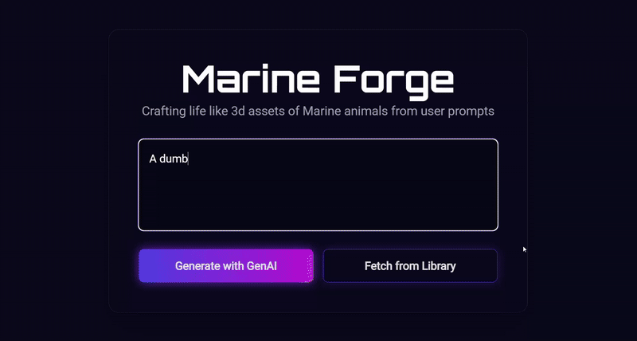
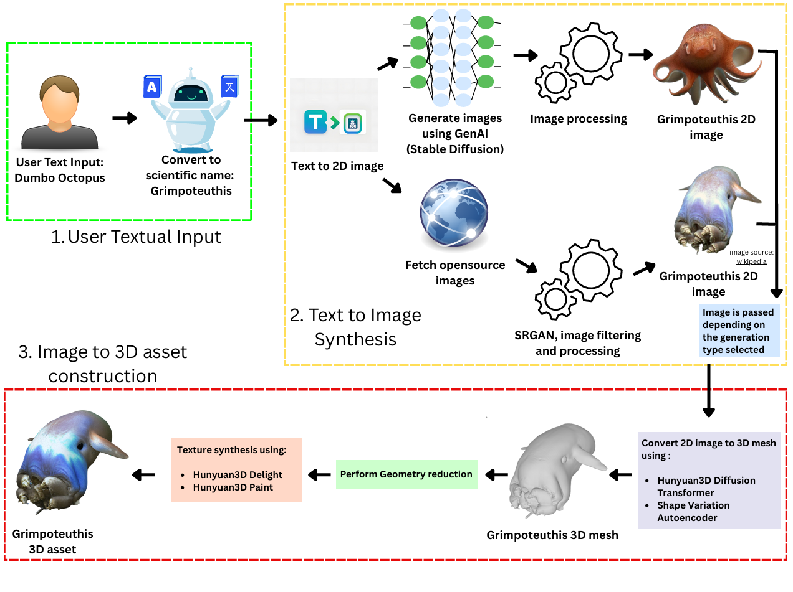
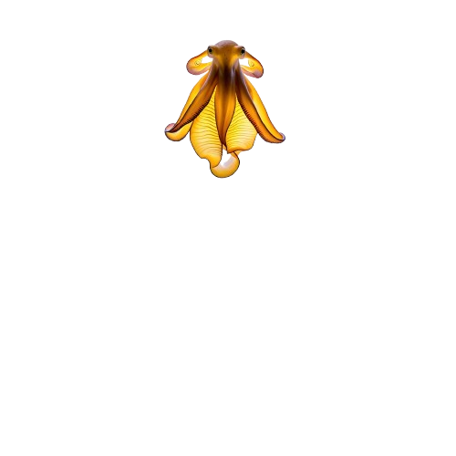
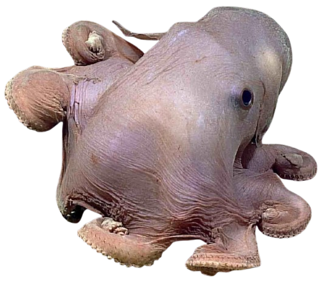
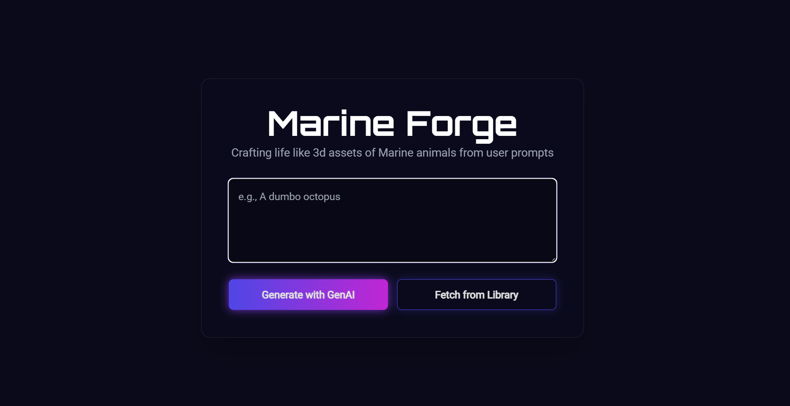
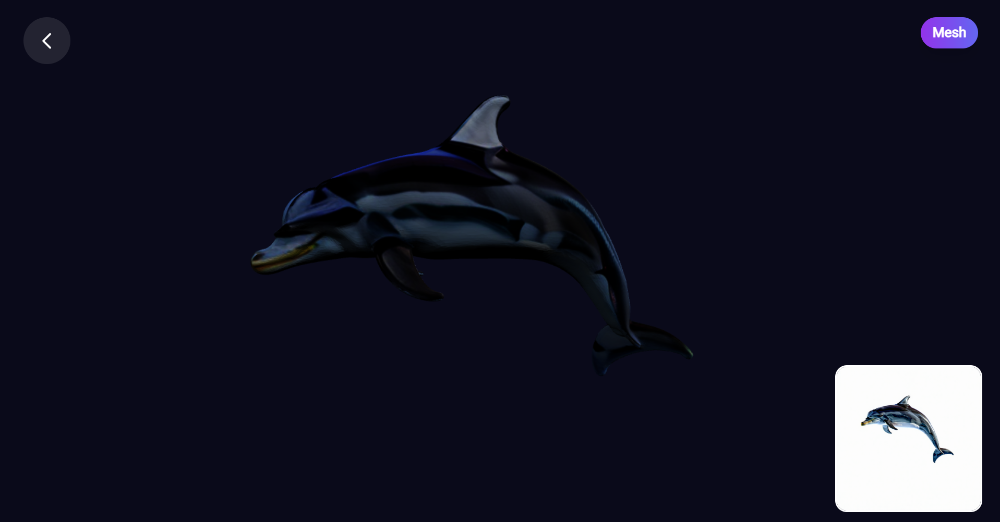

# mArIne3D


A project dedicated to leveraging generative AI for the creation and enhancement of marine biology resources. This repository contains tools to generate 2D images and 3D models of marine creatures, aiding in research, education, and conservation efforts.

---

## Table of Contents

- [Project Overview](#project-overview)
- [Key Features](#key-features)
- [In-Depth Feature Explanation](#in-depth-feature-explanation)
- [File Structure](#file-structure)
- [Getting Started](#getting-started)
  - [Prerequisites](#prerequisites)
  - [Installation](#installation)
  - [Usage](#usage)
- [Contributing](#contributing)
- [Future Goals](#future-goals)
- [License](#license)
- [Acknowledgements](#acknowledgements)

## Project Overview

This project focuses on developing AI-powered 3D models of marine species for educational and research applications. The system converts user text prompts into realistic 2D images using either Stable Diffusion 3.5 or real-world images from FathomNet for underrepresented species. These images are then transformed into interactive 3D assets using Tencent Hunyuan3D models, producing `.glb` files that can be rendered in Blender, Unity, or AR applications. The solution includes a web-based visualizer and a Unity-based interface to display both textured and mesh views, all deployed on RunPod for scalable access. The goal is to create dynamic, high-quality 3D representations of marine life for immersive learning experiences and scientific exploration.

<!--  -->
<div style="text-align: center;">
  
</div>


---

## Key Features
- **Dual-Mode Image Generation:** Translates user input into 2D images with two methods—Stable Diffusion 3.5 for generative images and FathomNet for actual images when unusual or underrepresented species are asked for.
- **Text-to-3D Conversion Pipeline:** Renders 3D GLB models from 2D images with Tencent Hunyuan3D models, delivering assets that are ready to use within Blender, Unity, or AR/VR projects.
-  **End-to-End Deployment:** Complete containerization solution deployed on RunPod with API endpoints to allow easy model execution on the cloud.
- **Interactive Web Visualizer:** Client based on HTML/CSS/JS for rendering 2D images and 3D models within the browser itself with support for viewing textured or mesh-only models.
- **Data Extensibility:** Framework prepared for eventual dataset generation—users can retrieve stored 3D assets from the server or create new ones dynamically.
- **Education-Oriented Design:** Models and tools designed for incorporation within high school biology syllabuses, rendering marine biology study interactive and fun.

---

## In-Depth Feature Explanation

<div style="text-align: center;">
  
</div>

### 1. Dual-Mode Image Generation

**Why:**  
**Generating 3D assets** directly from **textual prompts** is traditionally a **time-consuming**, **resource-heavy**, and **dataset-dependent** task. While there exist several **deep learning models** capable of **text-to-3D generation**, such as **DreamFusion** and **Latent-NeRF**, they are too **generic** for our **marine biology** use case. The lack of a comprehensive **open-source dataset** containing 3D models of **marine creatures** meant that **fine-tuning** these existing solutions for our application was not feasible.

However, we observed that although 3D **marine datasets** were scarce, there was a vast amount of **unstructured 2D image data** available online—for instance, searching **octopus** on **Google** yields thousands of images (albeit not all **open-source**). This led us to a critical realization: instead of building a 3D model generator from scratch, we could first generate **high-quality 2D images** from **text** and then convert these into **3D assets**.

This **two-step pipeline**—**text → 2D image → 3D model**—is the unique contribution of our work and forms the backbone of our entire solution. It not only bypasses the **dataset bottleneck** but also makes the **pipeline modular**, allowing improvements at each stage independently. This idea is the **core innovation** of the project and a major reason why our approach stands out.

---

**What:**  

**GenAI approach**  
For **text-to-image generation**, we systematically explored several **open-source generative models**, evaluating them for **performance**, **hardware requirements**, and **quality of outputs**:

- **Janus-Pro 7B/1.3B**: Produced **high-quality images** but required **heavy compute resources** (≥40GB VRAM for **full precision**), making **local execution impractical**.  
- **JanusFlow 1.3B**: **Lightweight model** (2.09GB) with **moderate hardware needs** but **slower generation times** (~4 mins per image).  
- **HiDream 17B**: Offered multiple **quality-speed tradeoffs** (**Full**, **Dev**, **Fast**), but again demanded ≥40GB VRAM for **full precision runs**.  
- **Flux.1 12B**: **Promising model** but required ≥24GB VRAM, limiting **accessibility**.  
- **DeepFloyd IF-I-XL-v1.0**: Took over an **hour per image** on limited hardware—**impractical** for our pipeline.  
- **Stable Diffusion 3.5**: Struck the best **balance** between **performance** and **output quality**.  

We ultimately adopted **Stable Diffusion 3.5 Large Turbo** for our pipeline, using the publicly available **inference API** from **Stability AI** and further optimizing it through **4-bit NF4 quantization** to enable execution on **mid-range GPUs** like the **RTX 3090** (16GB VRAM). This significantly reduced **memory usage** while preserving **output fidelity**.

Moreover, to address common **artifacts** such as **extra limbs** or **deformations** in generated images, we implemented **prompt tuning**. Users simply provide the **marine species name**, while our system automatically augments the **prompt** with **descriptive details** like **lighting**, **background**, and **anatomical correctness** to guide **Stable Diffusion** toward producing **clean**, **high-resolution**, and **anatomically accurate 2D renders**.

<!--  -->
<div style="text-align: center;">
  
</div>

**Image Fetching approach**  
A limitation that we predicted for our **text-to-2D pipeline** using **Stable Diffusion 3.5 Large Turbo** is that the model's **knowledge of marine biology** is inherently limited. Consequently, it may fail when tasked with generating images of **underrepresented marine species**. A typical solution would be **fine-tuning** the model on a **marine-specific dataset**, but due to **GPU resource constraints** during the project, this was not feasible.

To address this, we integrated **FathomNet**, a **real-world marine image database** that provides access to a wide range of **openly available marine species images**. This allows users to choose how they want to generate a 3D asset:

- **Generative AI Approach**: Using **Stable Diffusion 3.5 Large Turbo** to synthesize a 2D image from a textual prompt.  
- **Real-World Image Approach**: Fetching a **high-quality image** of the marine animal from **FathomNet**.

This is not a simple image fetch. **Multiple images** may exist for a single species, and the **quality of images** can vary. To ensure the **best possible input** for 3D reconstruction, we implemented a **super-resolution pipeline** using **SR_GAN**, along with a series of **filters** to select the optimal image.

**Filters and Selection Criteria**:

- **Brightness**: Ensures the image is well-lit.  
- **Sharpness**: Measured using **Laplacian variance** to avoid blurred images.  
- **Contrast**: Avoids washed-out or overly dark images.  
- **Weighted Scoring**: Combines **brightness**, **sharpness**, and **contrast** into a **composite quality score** to rank candidate images.  
- **Cropping and Centering**: Uses automated cropping to ensure the **marine animal is centered** and occupies the majority of the frame.  
- **Scientific Name Matching**: Users must provide the **scientific name** of the species as listed in **FathomNet**, ensuring accurate retrieval.  

Once the **highest-quality image** is selected, it undergoes **super-resolution enhancement** with **SR_GAN** to improve **clarity**, **detail**, and **texture fidelity** before being passed to the **2D-to-3D conversion stage**.

Hence by combining **Stable Diffusion 3.5 Large Turbo** with **FathomNet fallback** and **super-resolution filtering**, our **dual-mode image generation pipeline** ensures robust, high-quality, and **dataset-backed 2D images** for both **common** and **rare marine species**, providing a strong foundation for subsequent **3D model synthesis**.

<!--  -->
<div style="text-align: center;">
  
</div>


---
### 2. Image-to-3D Conversion Pipeline

**Why**  
The unique selling point of our solution is the **text-to-2D and 2D-to-3D conversion**. This enables the generation of **3D assets directly from text or images**, which is essential for education and research. While **dynamic 3D (4D) assets** could make learning more immersive, they require **hours of training on high-end GPUs**, making them impractical for real-time or on-demand usage. Hence, we focus on a **direct 2D-to-3D conversion pipeline** for faster and scalable results.


**What:**  
This pipeline converts a **2D image**—either generated via **Stable Diffusion 3.5 LT** or sourced from **FathomNet** (with **SR_GAN-based super-resolution** and **quality filtering**)—into a **3D asset**.

We explored **4D generation approaches** but ruled them out due to **prohibitive computation time**:

- **Animate124**: Converts images into animated 3D scenes using multi-stage training (textual inversion → 3D scene → coarse motion → fine motion).  
- **4D-fy**: Creates dynamic 3D scenes via hybrid score distillation sampling.  
- **Drawback**: Both require **per-image training (4–20 hours)** and up to **80GB GPU memory** → **not practical** for real-world deployment.


#### Chosen 3D Reconstruction Approaches

- **SF3D**  
  - Generates **UV-unwrapped, textured 3D meshes** (`.glb`) from images in **under a second**.  
  - Predicts **geometry, material properties**, and applies **automatic delighting**.

- **Hunyuan3D 2**  
  - Produces **state-of-the-art 3D reconstructions** using **depth estimation, novel view synthesis, and neural rendering**.  
  - **Inference-only** approach → no runtime training required.  
  - Delivers **high-quality meshes and textures** with consistent results.  
  - **Chosen as the final pipeline** due to superior reconstruction quality.

- **SPAR3D**  
  - Builds **segmentation-aware 3D assets** with **prompt-driven editing support**.  


#### Mesh Simplification Optimization  

While **Hunyuan3D 2** delivers the **best visual quality**, it has a **long processing time**, especially in the **texturing step** where the **mesh and input image** are combined to generate a textured 3D model.  

To optimize this:  
- The raw mesh from Hunyuan3D typically contains **10–15k triangles**.  
- We apply a **mesh simplification step** that reduces triangle count by up to **90%** before texturing.  
- This significantly **reduces computational overhead** during the **painting/texturing phase** while preserving essential geometry.  

This optimization ensures **faster inference** without compromising the **visual fidelity** of the final 3D assets.


#### Final Choice  
We finalized **Hunyuan3D 2 with mesh simplification** for our pipeline, balancing **output quality** with **runtime efficiency**. The system now generates **high-fidelity 3D assets** quickly, while retaining the **option for future 4D extensions** if needed.
.


#### Local inference of Hunyuan3D

*Efficiency Improvements*

- Submodule checkpoints (UNet, VAE, text encoder, etc.) were manually loaded at the class level to ensure conservative memory usage.
- After copying weights from submodule checkpoints into memory, the checkpoint models were deleted immediately, lowering peak RAM usage.
- Each larger composed model (e.g., Stable Diffusion pipelines) was isolated into its own process, enabling stricter memory management and faster, more reliable garbage collection.
- Submodules were executed with FP16 weights and CPU offloading where possible, further reducing GPU memory requirements.

*System Requirements for Local Inference*
- 18 GB system RAM (recommended)
- 6 GB VRAM (minimum for GPU inference)

*Tested Configuration*
- 24 GB system RAM (16 + 8, DDR5)
- NVIDIA RTX 3050 (6 GB VRAM)

*Performance (Tested Configuration)* 
- Mesh generation: ~3.5 minutes
- Texture generation: ~1.5 minutes

---

### 3. End-to-End Deployment

**Why:**  
Once the **text-to-2D** and **2D-to-3D** pipelines were ready, our next goal was to make them **accessible to users without requiring complex local setups**. Running the full pipeline on platforms like Kaggle caused **out-of-memory errors** due to GPU and RAM limitations. Moreover, we wanted to avoid users having to install large dependencies or wait for **HuggingFace models to download at runtime**.  

By deploying the solution on a **cloud-based GPU server** with preloaded models, we enabled users to run the full pipeline **with a single API call**, eliminating installation overhead and reducing **model loading latency**.


**What:**  
We used **RunPod** with a **NVIDIA RTX 3090 (24GB VRAM), 125GB RAM, and 24 vCPUs** to host the pipeline. The deployment workflow was as follows:

1. **Preloading Models**  
   - Instead of downloading models at runtime, we **downloaded them once** and stored them locally on the server.  
   - This optimization reduced **startup time** since models were loaded only once at server startup.

2. **Flask-based REST API**  
   - A simple **Flask server** exposed a `/generate` endpoint.  
   - Users sent a **JSON request** with parameters like `concept` (marine species name) and `method` (e.g., generative AI vs real image fallback).  
   - The server then triggered the **text-to-2D** and **2D-to-3D pipelines** with the preloaded models.

3. **High-performance GPU Execution**  
   - Using **Hunyuan3D-2** pipelines (`Hunyuan3DDiTFlowMatchingPipeline` for 3D mesh and `Hunyuan3DPaintPipeline` for texturing), the solution generated **GLB 3D assets** directly on the GPU.  
   - **Output assets** were saved in a structured folder for easy retrieval.

4. **API Response**  
   - The API returned **file paths of the generated 3D models** in JSON format, enabling seamless integration with **web visualizers** or **Unity clients**.


**Key Advantages:**  
- **No local setup needed** – users interact via a simple REST API.  
- **Preloaded models** reduce runtime latency.  
- **GPU-accelerated inference** ensures fast and high-quality 3D asset generation.  
- **Scalable architecture** – future models or features can be plugged in easily.  

**Alternatives explored:**  
- **Jetson Nano** – The project could not be build on jetson nano because the jetson nano we had supported jetpack 4.6.1. The only torch wheel available for jetson 4.6.1 is built for python 3.6. Thr dependencies of this project require minimum python 3.8+. Hence we could not host out logic here. Find more [details](https://www.notion.so/Bigger-problem-246c6cd1c23a80128d8fd723a6b8c841?source=copy_link).
- **Mac studio** - Many pieces of code for tencent hunyuan3D are written for cuda accelerator. To run on mac, cuda specific code was to be converted and ran on metal accelarator. In doing so, the precision was lost and we were not able to generate the textured mesh correctly. Find more [details](https://www.notion.so/Hunyuan3D-on-MAC-217c6cd1c23a808594fdd8f3e3f5dec2?source=copy_link)

---

### 4. Interactive Web Visualizer

**Why**  
While the backend pipeline produces **high-quality 3D assets**, users often find it difficult to work directly with raw `.glb` files or local viewers. For **better accessibility and usability**, we created a **lightweight web-based 3D visualizer**. It allows users to **generate, preview, and interact** with both the **mesh and textured 3D models** in a browser without requiring any local setup.  


**What**  
The frontend is a **minimal web interface** that:  
- Sends the **user prompt** to the backend API.  
- Receives **both raw mesh (`mesh.glb`) and textured mesh (`painted.glb`)** from the server.  
- Uses **Three.js** for real-time rendering in the browser.  
- Allows **toggling between mesh and textured views** through a simple button.  
- Adds **picture-in-picture display** of the original 2D image next to the 3D viewer for context.  
- Provides **smooth navigation controls** (zoom, pan, rotate) with **improved lighting and auto-scaling** for better visualization.  

The system automatically:  
- **Centers and scales** the model for optimal camera positioning.  
- **Handles window resizing** for responsive viewing.  
- **Cleans up** the WebGL context on page transitions to prevent memory leaks.  

This interactive frontend ensures a **complete end-to-end experience**: users start with a text prompt and end up **interacting with a fully generated 3D asset** in their browser with zero setup overhead.




---

<!-- ### 5. Unity Integration
**What it is:**  
[Add your explanation here]

**Brief Overview:**  
[Add how it works or what makes it useful]

--- -->

### 5. Data Extensibility

**Why:**  
This feature enables the system to evolve into a comprehensive dataset specifically for marine creatures. For educational or research purposes, users may not always need to generate new 3D assets manually—sometimes simply fetching an existing one suffices. By organizing generated assets by concept (e.g., marine creature name), we allow easy access to previously generated assets, reducing redundant computation and improving efficiency.

**What:**  
The feature introduces a database layer in addition to the existing presentation (web/Unity visualizer) and application (server code) layers, creating a three-tier architecture.  

Key elements include:
- **Asset Retrieval Option:** Users can either generate a new 3D asset or fetch an existing one stored in the database.  
- **Search Functionality:** A search system will check if a 3D asset for a given marine creature already exists before generating a new one.  
- **Database Management:**  
  - Decide where to store generated assets and how to organize them by concept name.  
  - Handle multiple assets for the same concept (e.g., different versions or quality levels).  
- **Future Extensibility:** The current design is preliminary and can evolve with improved database handling, indexing, and retrieval mechanisms for large-scale datasets.  

This setup provides the foundation for a **scalable three-tier system**:
1. **Presentation Layer** – Web and Unity-based visualizers for interacting with assets.  
2. **Application Layer** – Server-side code handling generation and retrieval logic.  
3. **Database Layer** – Storage and management of generated assets for efficient access.
   
<div style="text-align: center;">
  
</div>


---

## File Structure

```
mArIne3D/
├── .gitignore
├── README.md
├── Report.md
├── assets
│   ├── dumbo.png
│   ├── first.gif
│   ├── first.mp4
│   ├── first.png
│   ├── flow.png
│   ├── wimg1.png
│   └── wimg2.png
├── hy3dgen
├── image_model
│   └── SR_GAN_best.pth
├── notebooks
│   └── marine-text-to-3d.ipynb
├── output
├── requirements.txt
├── txt2_3D
│   ├── GenAI_image_generator.py
│   ├── Image_generator.py
│   ├── __init__.py
│   ├── generate_3d.py
│   ├── get_img_models.py
│   ├── get_models.py
│   ├── main.py
│   └── utils.py
├── visualiser
│   └── web
│       ├── app.py
│       ├── dummy_server.py
│       ├── output_assets
│       │   ├── dumbo.png
│       │   ├── first.png
│       │   ├── image.png
│       │   ├── mesh.glb
│       │   └── painted.glb
│       ├── remote_server.py
│       ├── static
│       │   ├── css
│       │   │   └── style.css
│       │   └── js
│       │       └── viewer.js
│       └── templates
│           └── index.html
└── zip_conversion.py
```

---

## Getting Started

### Prerequisites

- Python ≥3.8
- CUDA-enabled GPU (recommended 24GB VRAM for Hunyuan3D 2)
- Git
- pip

---

### Installation

#### Install Python Packages

```bash
git clone https://github.com/Dhruvanshu-Joshi/Marine_Biology_GenAI.git
cd Marine_Biology_GenAI
pip install -r requirements.txt
```
---

#### Build Custom Rasterizer

```bash
cd hy3dgen/texgen/custom_rasterizer
python setup.py bdist_wheel
pip install dist/custom_rasterizer*.whl
```

Verify installation:

```bash
find  -name "*custom_rasterizer_kernel*.so"
```

Add to Python path:

```python
import sys
sys.path.append('path to custom_rasterizer_kernel.cpython-311-x86_64-linux-gnu.so (output returned by the find)')
```

---

#### Localize Pretrained Models

**Hunyuan3D 2 models:**

You must be authenticated with a Hugging Face account to interact with the Hub. Create an account if you don’t already have one, and then sign in to get your User Access Token from your Settings page. The User Access Token is used to authenticate your identity to the Hub. Enter the token here.

```python
from huggingface_hub import login, snapshot_download

login(token="") # enter your token

# Download mesh and paint pipelines
snapshot_download(
    repo_id="tencent/Hunyuan3D-2",
    local_dir="models",
    allow_patterns=["hunyuan3d-dit-v2-0/model.fp16.safetensors",
                    "hunyuan3d-dit-v2-0/config.yaml"]
)

snapshot_download(
    repo_id="tencent/Hunyuan3D-2",
    local_dir="models",
    allow_patterns=["hunyuan3d-paint-v2-0-turbo/**"]
)

snapshot_download(
    repo_id="tencent/Hunyuan3D-2",
    local_dir="models",
    allow_patterns=["hunyuan3d-delight-v2-0/**"]
)
```

**T5 NF4 encoder:**

```python
snapshot_download(
    repo_id="diffusers/t5-nf4",
    local_dir="models/t5-nf4",
    local_dir_use_symlinks=False
)
```

**Stable Diffusion 3.5 LT:**

```python
from huggingface_hub import login, snapshot_download

login(token="YOUR_HUGGINGFACE_TOKEN")

snapshot_download(
    repo_id="stabilityai/stable-diffusion-3.5-large-turbo",
    local_dir="models/stable-diffusion-3.5-large-turbo",
    local_dir_use_symlinks=False
)
```

---

## Usage

### Server-side code

Once the above steps are done and and the prerequisites are installed (this section is to be done on a remote server which was the runpod pod in our case and can be the local system in your case):

- **Download the Models**
```bash
cd txt2_3D
python get_models.py
python get_img_models.py
```


- **2D Image Generation**

  1. Generate a 2D image from a text prompt using **Stable Diffusion 3.5 LT**.
  2. Optionally, use **FathomNet images** enhanced with SR_GAN and filtered for brightness, contrast, and sharpness.

- **3D Model Generation**

  1. Use **Hunyuan3D 2** for generating a 3D mesh from a single 2D image.
  2. Steps:
      - Generate a **mesh** from the image.
      - **Simplify the mesh** to reduce the number of triangles (from 10–15k to ~10%).
      - Generate **textured mesh** using the paint pipeline.
  3. Optional: Serve via **Flask endpoint** or visualize in web/Unity-based viewer.

- **Serve endpoint**
```bash
cd ..
cd visualiser/web
python remote_server.py
cd ..
cd ..
```

The endpoint should now be live on  http://ip-address:5000

For End to end result generation on local system (with required specifications),

Simply run

```bash
cd txt2_3D
python main.py
cd ..
```

### Client Side

```bash
cd visualiser/web
python app.py
```

You can run the project on:  http://127.0.0.1:8000

### Notebook

To avoid all these, run the** marine-text-to-3d.ipynb** in notebooks.

## Contributing

Contributions are what make the open-source community amazing. Any contributions you make are greatly appreciated.

1. Fork the Project 
2. Set upstream 
3. Create your Feature Branch:
   ```bash
   git checkout -b feature/AmazingFeature
   ```
4. Commit your Changes:
   ```bash
   git commit -m "Add some AmazingFeature"
   ```
5. Rebase from main:
   ```bash
   git fetch upstream
   git rebase upstream/main
   ```
6. Push to the Branch:
   ```bash
   git push origin feature/AmazingFeature
   ```
7. Open a Pull Request

---
## Future Goals

This project lays the foundation for AI-powered 3D asset generation for marine biology education. While the current implementation already supports text-to-3D conversion, visualization, and deployment, several avenues can be explored to enhance its capabilities further:

1. **Dataset Creation:**  
   Extend the solution to build a full-fledged dataset for marine creatures. Users can either fetch pre-generated 3D assets from the server or generate them on-demand, enabling resource-efficient usage for educational applications.

2. **3D Printing Toolkit:**  
   Develop a toolkit that directly converts generated `.glb` files into formats compatible with 3D printers, allowing physical models of marine species to be created for research and education.

3. **Animation Pipeline:**  
   Enhance generated 3D assets with animations using tools like UniRig to build skeletal structures (rigging). A basic pipeline has already been initiated to support motion-enabled 3D assets for interactive AR/VR experiences.

4. **Domain-Specific Fine-Tuning:**  
   Expand the current solution beyond marine biology by creating a user-friendly toolkit for fine-tuning Stable Diffusion 3.5 on custom datasets. This will enable domain-specific 3D asset generation across various industries and research fields.

---

## Acknowledgements

I would like to express my heartfelt gratitude to my mentors, **Krishan Mohan Patel**, **Himanshu Kumar**, and **Supreeth Kumar M**, for their unwavering support and guidance throughout this project. Their collective expertise, patient mentorship, and thoughtful insights have been instrumental in shaping both the technical depth and the direction of this work. The lessons learned under their mentorship will serve as a lasting foundation for future endeavors in this domain.  

I would also like to extend my sincere appreciation to the developers of **[Stable Diffusion](https://stability.ai/stable-diffusion)**, whose groundbreaking contributions in generative AI have enabled the seamless conversion of text into high-quality 2D imagery.  

My gratitude further extends to **[Tencent Hunyuan3D](https://github.com/Tencent-Hunyuan/Hunyuan3D-2.git)**, whose innovative work in text-to-3D asset generation has been invaluable in bringing this project to life.  

I would also like to acknowledge **[FathomNet](https://www.mbari.org/data/fathomnet//)** and the many **open-source projects** leveraged in this work. Their open contributions to the community have provided the essential tools, datasets, and frameworks that made this project possible.  

This project is a small step forward, built upon the remarkable advancements of the open-source and research communities. To each of these contributors and mentors, I extend my deepest thanks.  

